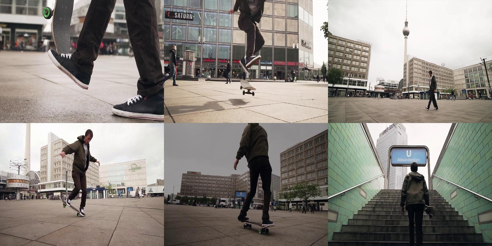

# Collage-Creator-from-Video-Frames
A program to automatically create a collage based off frames from a video using the 'skimage' framework  
The features extracted from each video frame, as well as the way they were put together to construct the collage is explained below.  
<b>Features Extracted</b>:
    <ul><li>Colour Variance: The colour variance in each image was calculated based on the histogram, considering each RGB channel as an independent quantity to finally calculate the combined colour variance of the entire image.</li>
    <li>Edge Information: The number of pixels that were contributing to edges as per the Canny Edge Detection Method were analysed in each image.</li>
    <li>Corner Information: The intensity of pixels being a corner using FAST Corner Detection (based on using 16 pixels around the interest point) calculated over an entire image.</li></ul>
<b>Placing the Images in the Collage (2*3 Grid)</b>:  
    <ul><li>The images with highest color variation and edge pixels (combination of these two) are given the highest priority to be in the center 2 spots (between these two, colour variation to filter out two images with the one with more edges to be placed at the top out of the two). This is because people tend to view these quantities better at the centre, at first glance.</li>
    <li>For the remaining four corner spots, images with higher corner and edge information (combination of these 3 quantities with priority in the same order) are given top left corner spots. This is because people don’t tend to observe the bottom parts of a collage as much, so it is better to leave less information there.</li></ul>
To run the program, run the command below (prefarbly in a linux terminal with a Python version >= 3.7 & skimage installed)

    python3 CollageCreator.py
This should output an image that looks something like (might be different, based on the different random frames the program selects) 
 
The frames have been taken from <a href="https://www.youtube.com/watch?v=VUs_iPB-PDw">this</a> YouTube video.  
This program was developed as an assignment, as a part of of the course CS518: Computer Vision, taken by Dr. Abhinav Dhall, at IIT Ropar.

